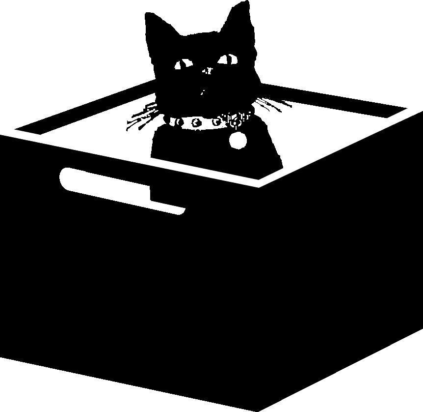

Crates is a database for your media allowing F2F curation and sharing of playlists.

**BASE CLASSES WILL BE PROVIDED**. For iterative modules, a generator interface
may be defined soon to support progress bars and time remaining indicators.

Logical Modules

1. **CAS**: Content addressable store for immutable data (MP3 files etc).
2. **index**: Database of file metadata
3. **Mutators**: Systems which query the database and create new files with better
   metadata. Old files are deprecated. Deprecated files can be garbage collected if desired.
4. **Crawlers**: Systems that programatically add files
5. **Mapper**: Part of (1) and (2) which organises files as symlinks on the
   filesystem. Other apps can then use the database.
6. **API**: Remote queries to support authenticated peers. Files can be shared
   between peers. Thanks to immutability, peers are verified backups.
7. **Sets** : Stor

Sets of files can be created to make playlists known as "Crates".

# Mutators
Examples:
  * Add generated metadata (in one go): chromaprint/acoustid, BPM, Camelot key, MBID
  * Identify songs that have no metadata via acoustid API call (or correct existing)
  * Get some better album art

Mutator operation:
  1. Query database for files that can be upgraded. Eg, search for files with no chromaprint or low bitrate.
  2. Grab the file from the CAS and modify it
  3. Reinsert the file in the normal way. **All metadata should (ideally) be contained within the file.**

# Crawlers

Examples:
  * Filesystem (this includes itunes)
  * Soundcloud (sync ability)
  * Peer -- another crates server via query or feed
  * iTunes vi pyitunes: better metadata might be available.

Crawlers may create a fully-packed MP3 file in a temporary location if
necessary. For example, raw soundcloud MP3s had little metadata. It is not
necessary for mutators to be used in conjunction with crawlers.

# Peers
Authenticated crates servers may talk to one another to download records from indexes and CAS.

# Playlists ("crates")
One of the main features of crates is to be able to make/share playlists for
DJing. Each playlist has an ID and is shared with Peers.

Serato/Mixxx/Traktor import/export is planned.

# Installation
`sudo apt-get install libpython-dev python-pip`
`sudo pip install --upgrade -r requirements.txt`

Edit crates/settings.py

## Development

    # create database and superuser account
    ./manage.py syncdb
    # run local server in development mode
    ./manage.py runserver 0.0.0.0:8080
    # crawl
    ./manage.py crawl ~/Music

## Production
Guide pending, uses nginx+uwsgi+ansible

# Consumption
Map to a location:

	./manage.py map /exports/music

Then run a samba server with example conf. To get play counts and notifications
run hit counter daemon.
